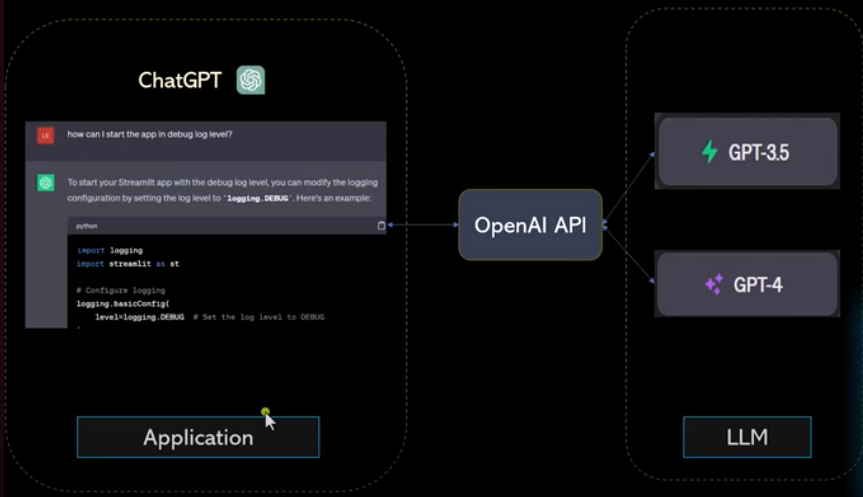
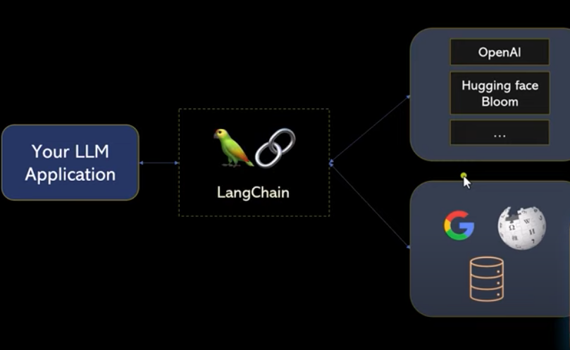

### LangChain
what is LangChain? and what kind of problem does it addressed?
Langston is a framework that allows you to build applications on top of llm or large language model.
when you are using chat GPT as an application internally it is making call to OpenAI API which internally uses any llm such as GPT 3.5 or 4.

<!--  -->

 Nowadays there is a big boom in the industry where every business wants to build their own llm. so why they can't use chat GPT?

- because GPT has no access to your internal organization data so people want to build applications which are based on llm.

why do business not use this kind of architecture?
- first of all calling open AI API has a cost associated with it for every thousand token they will charge point zero zero two dollar and if you're a startup who is having funding issues.
- chat GPT doesn't answer latest question its knowledge is limited to September 2021 as of this video recording so if you want to incorporate some latest information let's say from Google Wikipedia or somewhere else you can't get that here.
- the other issue is atlick is my own software development and data science company if I want to know how many employees joined last month chat GPT can't answer  because it doesn't have access to my own internal organization data.
 so if you use this kind of architecture for building your application you will hit some roadblocks or you will rather have some limitation and look open AI guys are pretty smart actually if they want they can address all of this but their stance is very clear we will provide foundational apis and building framework is something that other people should do.
 
 openAI API it is not enough to build llm therefore you need some kind of framework where you can call open AI a gpt3 gpt4 or maybe if you want to save the cost you call some open source models such as hugging face, Bloom there are so many models out there.
 

  let's say you want to use them you don't want to spend money on open AI gpt3 model then this framework should provide that plug-in Play support you know where you can integrate to one of these models and your code kind of Remains the Same this framework should also provide integration with Google search Wikipedia or even integration with your own organizational databases so that the application can pull information from these various sources as well and this framework is `LangChain`.
   `LangChain`:  It's a framework that allows you to build applications using llm. 